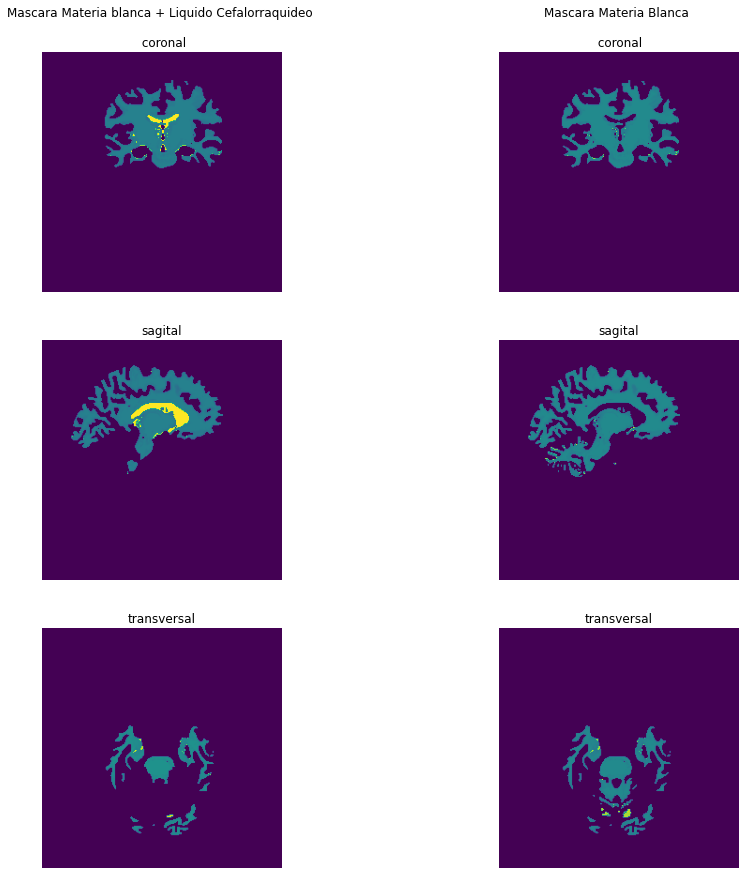

---

***Andres Eduardo Aracena Rangel***

---

Previamente se ejecuto el comando ***reconall*** de freesurfer a la imagen anatomica, con el notebook ***recon-all.ipynb***. Los resultados se guardan en la carpeta freesurfer, obteniendo las siguientes carpetas para cada sujeto:


```python
%ls /home/aracena/thesis_practica/tips_nibabel/3_recon-all_freesurfer/output/freesurfer/sub-01/
```

    label/  mri/  scripts/  stats/  surf/  tmp/  touch/  trash/


Siendo la carpeta ***mri*** de nuestro interes, el cual contiene los siguientes archivos:


```python
%ls /home/aracena/thesis_practica/tips_nibabel/3_recon-all_freesurfer/output/freesurfer/sub-01/mri/
```

    antsdn.brain.mgz                         norm.mgz
    aparc.a2009s+aseg.mgz                    nu.mgz
    aparc+aseg.mgz                           orig/
    aparc.DKTatlas+aseg.mgz                  orig.mgz
    aseg.auto.mgz                            orig_nu.mgz
    aseg.auto_noCCseg.label_intensities.txt  rawavg.mgz
    aseg.auto_noCCseg.mgz                    rh.ribbon.mgz
    aseg.mgz                                 ribbon.mgz
    aseg.presurf.hypos.mgz                   segment.dat
    aseg.presurf.mgz                         surface.defects.mgz
    brain.finalsurfs.mgz                     T1.mgz
    brainmask.auto.mgz                       talairach.label_intensities.txt
    brainmask.mgz                            talairach.log
    brain.mgz                                talairach_with_skull.log
    ctrl_pts.mgz                             transforms/
    filled.auto.mgz                          wm.asegedit.mgz
    filled.mgz                               wm.mgz
    lh.ribbon.mgz                            wmparc.mgz
    mri_nu_correct.mni.log                   wm.seg.mgz
    mri_nu_correct.mni.log.bak


&nbsp;
# Visualización de mascaras de Materia Blanca con *nibabel*

Acronimos

- wm = white matter (materia blanca)

- csf = cerebrospinal fluid (liquido cefalorraquídeo)

## Importamos librerias


```python
import time # medir el tiempo de ejecución de nuestros programas
start = time.process_time()
inicio = time.time()
```


```python
import os # El módulo os nos permite acceder a funcionalidades dependientes del Sistema Operativo
from os.path import join as opj # Este método concatena varios componentes de ruta con exactamente un separador de directorio(‘/’)
from matplotlib.figure import Figure
import nibabel as nib
import numpy as np
import matplotlib.pyplot as plt
import scipy.ndimage as ndimage #para rotar img
```

## Definimos Funciones


```python
# Creamos una funcion para ingresar el corte/slice que se desea extraer
# Verificamos que el usuario ingrese un numero natural y que se encuentre entre los 
    # cortes de la imagen cargada
    
def ingresar_corte(name, v_ini, v_fin):
    while True:
        print('\n------------------------------------------\n')
        print('La imagen', name, 'posee', vol_fin, 'cortes/slices', '\n',
             'ingrese un valor entre 0 y', vol_fin)
        print('\n------------------------------------------')
        co_vo =  input('\n Ingrese el corte/slice que desea visualizar: ')
        ver_num = co_vo.isnumeric()
        if ver_num == True: 
            co_vo = int(co_vo) # covertimos a int para poder usar en sentencias
            if v_ini <= co_vo <= v_fin: # que se encuentre los volumenes
                print('\n------------------------------------------\n')
                print('El corte/slice', co_vo, 'sera visualizado')
                print('\n------------------------------------------')
                return co_vo
                break
            else:
                print('\nERROR. Se debe ingresar un numero natural y',
                          '\n entre la cantidad de cortes/slices')
        else:
            print('\nERROR. Se debe ingresar un numero natural y',
                          '\n entre la cantidad de cortes/slices')
```

## Definimos Parámetros


```python
# Ruta del directorio del proyecto
experiment_dir = '/home/aracena/thesis_practica/tips_nibabel/' 

# Ruta de resultados de recon-all de freesurfer con segmentaciones
freesurfer_dir = opj(experiment_dir,'3_recon-all_freesurfer','output','freesurfer','sub-01','mri')

'''
Ruta de la imagen segmentada de la materia blanca + liquido cefalorraquídeo
'''
path_wm_csf = opj(freesurfer_dir,'wm.mgz')

'''
Ruta de la imagen segmentada solo materia blanca
'''
path_wm = opj(freesurfer_dir,'wm.seg.mgz')

'''
Ruta donde se guardaran los resultados
'''
output_dir = opj(experiment_dir,'4_visualizacion_mascara','output')

# Crear la carpeta de salida
os.system('mkdir -p %s'%output_dir)
```


    0


## Cargamos las imagenes y creamos los objetos mask_X


```python
mask_wm_csf = nib.load(path_wm_csf)

mask_wm = nib.load(path_wm)


'''
Atributos
'''

# Forma de la Matriz
form_mask_wm_csf = mask_wm_csf.shape # Atributo --> Forma Matriz
print('Forma de la matriz mask_wm_csf:', '\n', form_mask_wm_csf, '------>', '3D', '\n')

form_mask_wm = mask_wm.shape # Atributo --> Forma Matriz
print('Forma de la matriz mask_wm:', '\n', form_mask_wm, '------>', '3D', '\n')
```

    Forma de la matriz mask_wm_csf: 
     (256, 256, 256) ------> 3D 
    
    Forma de la matriz mask_wm: 
     (256, 256, 256) ------> 3D 
    


## Cargamos datos de las imagenes


```python
datos_mask_wm_csf = mask_wm_csf.get_fdata()
datos_mask_wm = mask_wm.get_fdata()

# Numero de elementos
cant_wm_csf = datos_mask_wm_csf.size # Atributo np --> Numero de elementos Matriz
print('Numero de elementos de la mask_wm_csf:', '\n', cant_wm_csf, '\n')

cant_wm = datos_mask_wm.size # Atributo np --> Numero de elementos Matriz
print('Numero de elementos de la mask_wm:', '\n', cant_wm, '\n')
```

    Numero de elementos de la mask_wm_csf: 
     16777216 
    
    Numero de elementos de la mask_wm: 
     16777216 
    


## Seleccionar un corte


```python
# Le indicamos al usuario que ingrese el corte/slice que desea extraer del
# volumen seleccionado

# Definimos los inputs de la funcion 'ingresar_corte'
name = 'mask_wm_csf (y mask_wm)'
vol_in = 0 # volumen inicial --> v_ini
vol_fin = form_mask_wm_csf[2] # volumen final --> v_fin

# Usamos funcion
cor_sel = ingresar_corte(name,vol_in,vol_fin)
```

    
    ------------------------------------------
    
    La imagen mask_wm_csf (y mask_wm) posee 256 cortes/slices 
     ingrese un valor entre 0 y 256
    
    ------------------------------------------
    
     Ingrese el corte/slice que desea visualizar: 115
    
    ------------------------------------------
    
    El corte/slice 115 sera visualizado
    
    ------------------------------------------


## Visualizar el corte seleccionado


```python
'''
corte coronal
'''
coro_wm_csf = datos_mask_wm_csf[:, :,cor_sel]
coro_wm = datos_mask_wm[ :, : ,cor_sel]

#rotada
coro_wm_csf_r = ndimage.rotate(coro_wm_csf, -90, reshape=True)
coro_wm_r = ndimage.rotate(coro_wm, -90, reshape=True)

'''
corte sagital
'''
sagi_wm_csf = datos_mask_wm_csf[cor_sel,:, :]
sagi_wm = datos_mask_wm[ cor_sel,:, :]

#rotada
sagi_wm_csf_r = ndimage.rotate(sagi_wm_csf, 0, reshape=True)
sagi_wm_r = ndimage.rotate(sagi_wm, 0, reshape=True)

'''
corte transversal
'''
tran_wm_csf = datos_mask_wm_csf[:,cor_sel, :]
tran_wm = datos_mask_wm[ :, cor_sel, :]

#rotada
tran_wm_csf_r = ndimage.rotate(tran_wm_csf, 90, reshape=True)
tran_wm_r = ndimage.rotate(tran_wm, 90, reshape=True)


'''
Mostramos las imagenes
'''

fig = plt.figure(figsize=(15, 15))
plt.subplot(3,2,1)
plt.imshow(coro_wm_csf_r)
plt.title('Mascara Materia blanca + Liquido Cefalorraquideo \n\n coronal')
plt.axis('off')
plt.subplot(3,2,2)
plt.imshow(coro_wm_r)
plt.title('Mascara Materia Blanca \n\n coronal')
plt.axis('off')
plt.subplot(3,2,3)
plt.imshow(sagi_wm_csf_r)
plt.title('sagital')
plt.axis('off')
plt.subplot(3,2,4)
plt.imshow(sagi_wm_r)
plt.title('sagital')
plt.axis('off')
plt.subplot(3,2,5)
plt.imshow(tran_wm_csf_r)
plt.title('transversal')
plt.axis('off')
plt.subplot(3,2,6)
plt.imshow(tran_wm_r)
plt.title('transversal')
plt.axis('off')
fig.patch.set_facecolor('xkcd:white')
plt.show()

```


    

    


# Extracción de la mascara de CSF


```python
'''
corte coronal
'''

coro_csf = np.subtract(coro_wm_csf,coro_wm)

'''
corte sagital
'''

sagi_csf = np.subtract(sagi_wm_csf,sagi_wm)

'''
corte transversal
'''
tran_csf = np.subtract(tran_wm_csf,tran_wm)

#rotaciones
coro_csf_r = ndimage.rotate(coro_csf, -90, reshape=True)
sagi_csf_r = ndimage.rotate(sagi_csf, 0, reshape=True)
tran_csf_r = ndimage.rotate(tran_csf, 90, reshape=True)

'''
Mostramos las imagenes
'''

fig = plt.figure(figsize=(15, 15))
plt.subplot(3,1,1)
plt.imshow(coro_csf_r)
plt.title('Mascara Liquido Cefalorraquideo \n\n coronal')
plt.axis('off')
plt.subplot(3,1,2)
plt.imshow(sagi_csf_r)
plt.title('sagital')
plt.axis('off')
plt.subplot(3,1,3)
plt.imshow(tran_csf_r)
plt.title('trasnversal')
plt.axis('off')
fig.patch.set_facecolor('xkcd:white')
plt.show()
```


    

    


# Tiempo de ejecución del codigo


```python
fin = time.time()
end = time.process_time()
tiempo = fin - inicio
tiempo2 = end - start

print('-----------------------------\n', 
      'tiempo de ejecución\n', tiempo, 'seg\n',
     '-----------------------------\n')
print('---------------------------------------\n', 
      'tiempo de ejecución del sistema y CPU\n', tiempo2, 'seg\n',
     '---------------------------------------\n')


```

    -----------------------------
     tiempo de ejecución
     6.675364971160889 seg
     -----------------------------
    
    ---------------------------------------
     tiempo de ejecución del sistema y CPU
     2.9542681199999996 seg
     ---------------------------------------
    


# Fin
